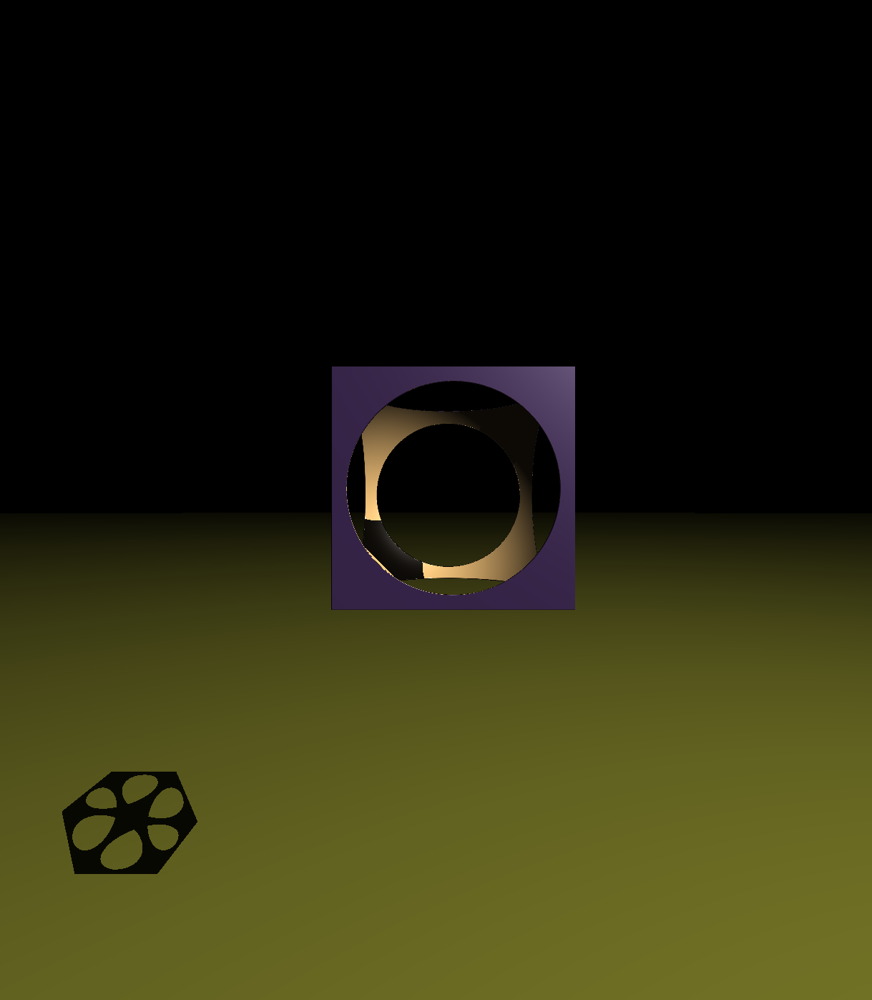
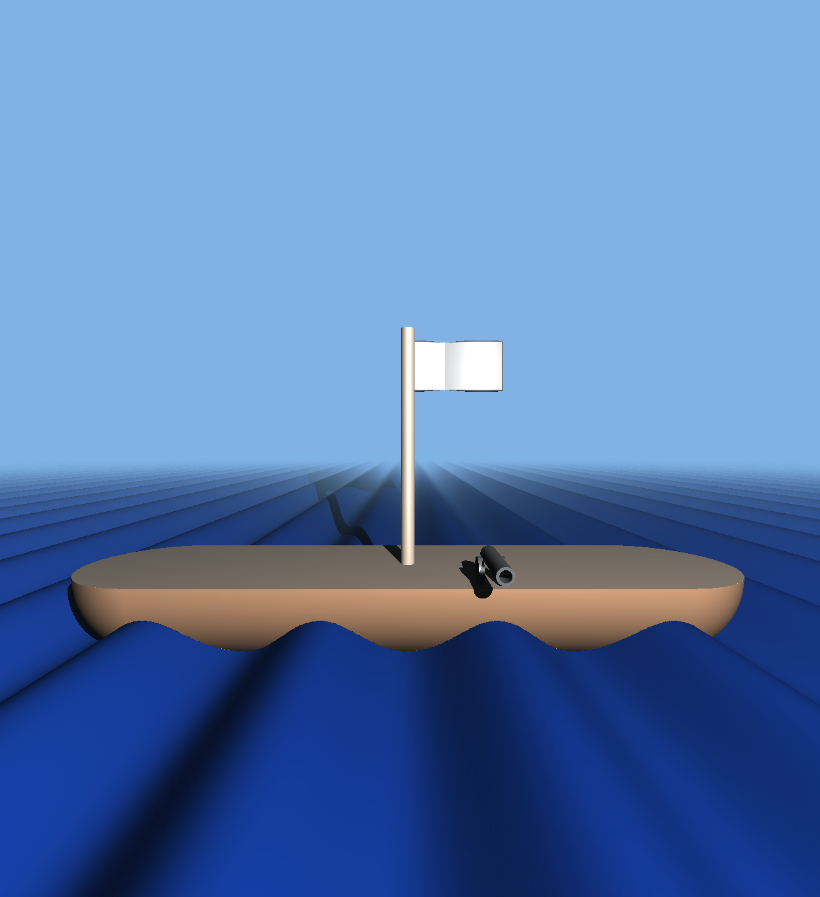
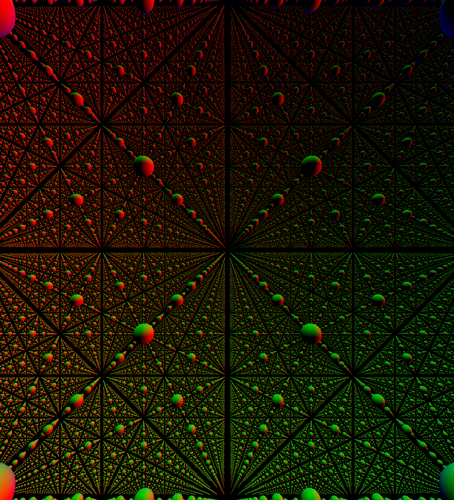
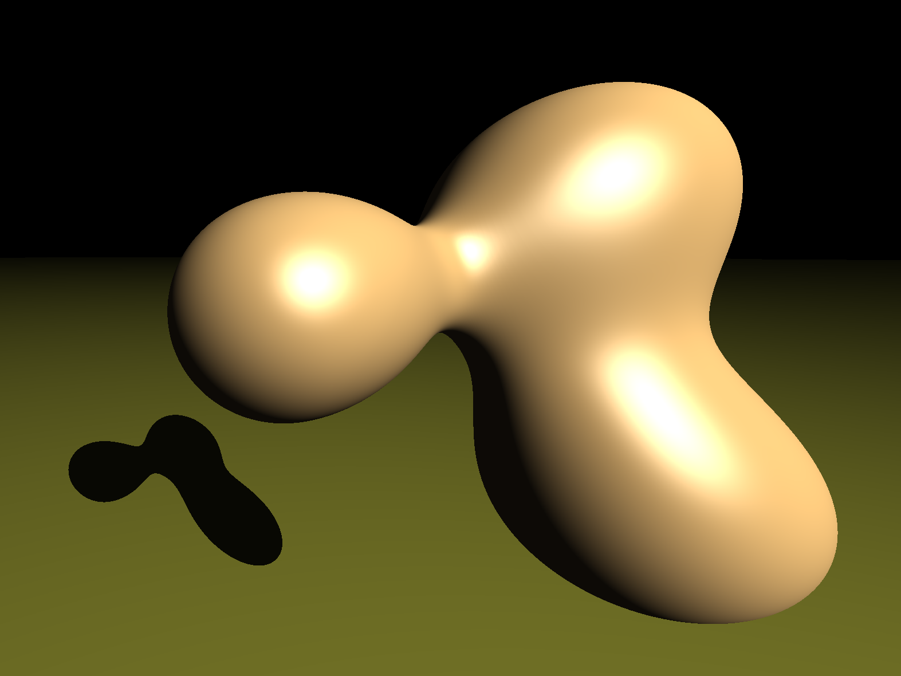
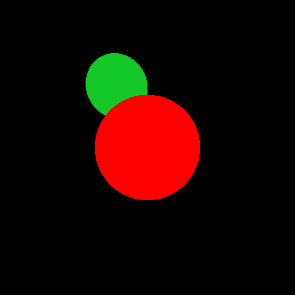

# RayMarcher

A simple low lever raymarcher in `C++`.
Two versions has been implemented, one using `OpenGL`,
`glut` and `glew`,one without any libraries except the standard library.
To build the two versions, make sure that you have `g++` and `make`.

## With OpenGL

### Build With OpenGL

```command
cd version_with_openGL
make
```

### Run With OpenGL

The program has 3 scenes that can be loaded, just use

```command
./main X
```

where X is the scene to load. You can move in the scene using the WASD keys.

Scene 0 contains a complex object that you can move and see its shadows.


Scene 1 contains a boat with moving water and a canon
that you can fire using the space bar.



Scene 2 is a fractal scene.


And Scene 3 is a scene when 3 objects can morph together while moving them.


## Without OpenGL

### Build Without OpenGL

```command
cd version_without_openGL
mkdir build
cd build
cmake ..
make
```

### Run Without OpenGL

```command
./main
```

This will run the program using the different elements that is contained in
the `main.cpp` file and store the result in a new `RayMarch_img.ppm` image.


